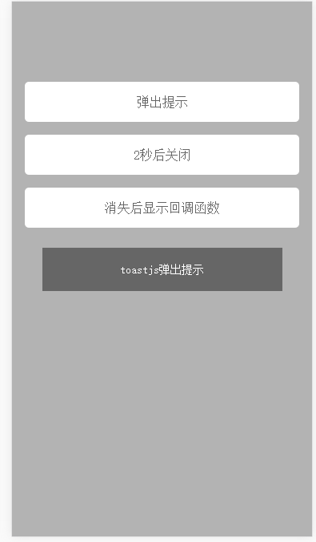

# toastjs

## 安装

可以通过npm安装

```
npm install toastjs
```

也可以通过脚本引入：

```
<script src="build/toastjs.js"></script>
```

## 用法 1

```javascript
toast('toastjs弹出提示');
```

## 用法 2

```javascript
toast('toastjs弹出提示', 2000);
```

## 用法 3

```javascript
toast('toastjs弹出提示', 2000, function(){

});
```
效果图

